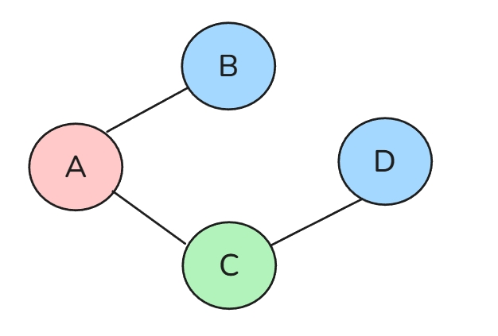

# Three-Color Map Coloring

**Difficulty:** Medium
**Tags:** Backtracking

## Description

Given a list of nodes `locations`, and a list of lists representing pairwise nodes `adjacencies`, determine whether it is possible to assign one of three colors ("red", "blue", "green") to each node such that no two adjacent nodes share the same color. Return `true` if such a coloring exists, otherwise return `false`.

**Constraints:**

- Each list in the `adjacencies` list represents a bidirectional edge.
- Assume no duplicate edges or self-loops are present.

**Example 1:**

> **Input:** locations = ["A", "B", "C", "D"], adjacencies = [["A", "B"], ["A", "C"], ["B", "C"], ["C", "D"]] > **Output:** true
> **Explanation:** > 
> A valid coloring exists—for example, assigning A = "red", B = "blue", C = "green", and D = "blue" ensures that every pair of adjacent nodes has different colors.

**Example 2:**

> **Input:** locations = ["A", "B", "C", "D"], adjacencies = [["A", "B"], ["A", "C"], ["A", "D"], ["B", "C"], ["B", "D"], ["C", "D"]] > **Output:** false

**Example 3:**

> **Input:** locations = ["A", "B", "C", "D", "E", "F"], adjacencies = [["A", "B"], ["A", "C"], ["B", "D"], ["B", "E"], ["C", "F"]] > **Output:** true
