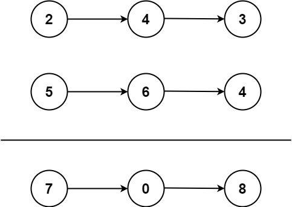

# 2. Add Two Numbers

## LeetCode [2. Add Two Numbers](https://leetcode-cn.com/problems/add-two-numbers/)

### Description

You are given two **non-empty** linked lists representing two non-negative integers. The digits are stored in **reverse order**, and each of their nodes contains a single digit. Add the two numbers and return the sum as a linked list.

You may assume the two numbers do not contain any leading zero, except the number 0 itself.

**Example 1:**



```text
Input: l1 = [2,4,3], l2 = [5,6,4]
Output: [7,0,8]
Explanation: 342 + 465 = 807.
```

**Example 2:**

```text
Input: l1 = [0], l2 = [0]
Output: [0]
```

**Example 3:**

```text
Input: l1 = [9,9,9,9,9,9,9], l2 = [9,9,9,9]
Output: [8,9,9,9,0,0,0,1]
```

**Constraints:**

* The number of nodes in each linked list is in the range `[1, 100]`.
* `0 <= Node.val <= 9`
* It is guaranteed that the list represents a number that does not have leading zeros.

### Tags

Linked List, Math

### Solution

结果将存储在新链表上。首先创建新链表的头节点并用一个指针`cur`指向它。初始化进位变量`c`。进入循环，条件是`l1`和`l2`至少有一个不为空。如果`l1`不为空，则将`l1.Val`累加到`cur.Val`并且`l1`指向其下一个元素，`l2`也一样。更新进位变量`c = cur.Val / 10`，以及当前节点值`cur.Val %= 10`。创建`cur`的下一个节点并初始化其值为`c`，并将`cur`指向它。与此同时用另一个指针`pre`维护`cur`移动前的位置。退出循环后，如果`cur.Val == 0`，则要通过`pre.Next = nil`将`cur`指向的节点移除。最后返回新链表头部节点指针。

We create a new list to store the sum of two input lists. We assign a pointer `cur` to the head of the new list,  and initialize a carry variable `c`. Enter a loop which condition is either `l1` or `l2` is not `null`. Then, if l1 is not null, add `l1.Val` to `cur.Val` and `l1` points to its next node, so does `l2`. Update the carry `c = cur.Val / 10`, and the current value `cur.Val %= 10`. We initialize a new node whose value is equal to `c` and assign it to `cur.Next`. Then we move `cur` to this new next. Meanwhile, we use another pointer `pre` to keep track of the position before `cur` moving. After the loop, we have to check if    `cur.Val == 0` , if so we need to set `pre.Next = nil` to purge the node that `cur` points to. Return the head node of the new list in the end.

### Complexity

* Time complexity: $$O(n)$$
* Space complexity: $$O(n)$$

### Code

```go
func addTwoNumbers(l1 *ListNode, l2 *ListNode) *ListNode {
	head := &ListNode{}
	cur, pre := head, head
	var c int
	for l1 != nil || l2 != nil {
		if l1 != nil {
			cur.Val += l1.Val
			l1 = l1.Next
		}
		if l2 != nil {
			cur.Val += l2.Val
			l2 = l2.Next
		}
		c = cur.Val / 10
		cur.Val %= 10
		cur.Next = &ListNode{c, nil}
		pre = cur
		cur = cur.Next
	}
	if cur.Val == 0 {
		pre.Next = nil
	}
	return head
}
```

## Reference

1. [https://books.halfrost.com/leetcode/ChapterFour/0001~0099/0002.Add-Two-Numbers/](https://books.halfrost.com/leetcode/ChapterFour/0001~0099/0002.Add-Two-Numbers/)

