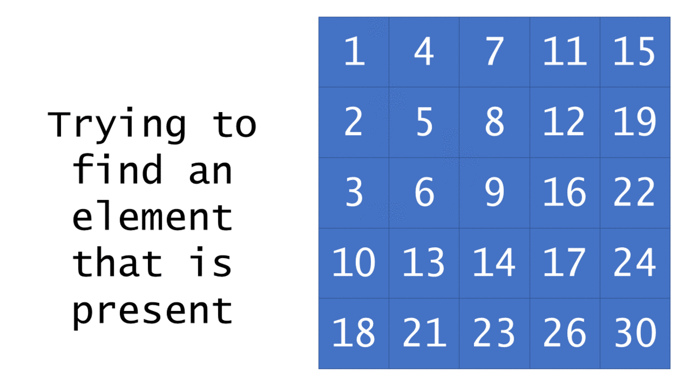

# 240. Search a 2D Matrix II

## LeetCode [240. Search a 2D Matrix II](https://leetcode-cn.com/problems/search-a-2d-matrix-ii/)

### Description

Write an efficient algorithm that searches for a `target` value in an `m x n` integer `matrix`. The `matrix` has the following properties:

* Integers in each row are sorted in ascending from left to right.
* Integers in each column are sorted in ascending from top to bottom.


**Example 1:**

```text
Input: matrix = [[1,4,7,11,15],[2,5,8,12,19],[3,6,9,16,22],[10,13,14,17,24],[18,21,23,26,30]], target = 5
Output: true
```

**Example 2:**

```text
Input: matrix = [[1,4,7,11,15],[2,5,8,12,19],[3,6,9,16,22],[10,13,14,17,24],[18,21,23,26,30]], target = 20
Output: false
```

**Constraints:**

* `m == matrix.length`
* `n == matrix[i].length`
* `1 <= n, m <= 300`
* `-109 <= matix[i][j] <= 109`
* All the integers in each row are **sorted** in ascending order.
* All the integers in each column are **sorted** in ascending order.
* `-109 <= target <= 109`

### Tags

Array, Binary Search, Divide and Conquer

### Solution



Perform a search which starts from the bottom-left element, and return true only if `target` is found. If the element is larger than `target`, check the element just above it. Otherwise, check the element to its right. Return false if the search finishes.

### Complexity

* Time complexity: $$O(m+n)$$
* Space complexity: $$O(1)$$

### Code

```go
func searchMatrix(matrix [][]int, target int) bool {
	for i, j := len(matrix)-1, 0; i >= 0; i-- {
		for j < len(matrix[0]) {
			if matrix[i][j] == target {
				return true
			}
			if matrix[i][j] > target {
				break
			} else {
				j++
			}
		}
	}
	return false
}
```

## Reference

1. [搜索二维矩阵 II](https://leetcode-cn.com/problems/search-a-2d-matrix-ii/solution/sou-suo-er-wei-ju-zhen-ii-by-leetcode-2/)


