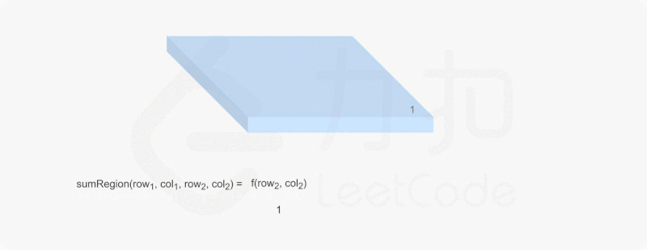

# 304. Range Sum Query 2D - Immutable

## LeetCode [304. Range Sum Query 2D - Immutable](title)

### Description

Given a 2D matrix `matrix`, find the sum of the elements inside the rectangle defined by its upper left corner `(row1, col1)` and lower right corner `(row2, col2)`.

Implement the NumMatrix class:

* `NumMatrix(int[][] matrix)` initializes the object with the integer matrix `matrix`.
* `int sumRegion(int row1, int col1, int row2, int col2)` returns the sum of the elements of the `matrix` array inside the rectangle defined by its upper left corner `(row1, col1)` and lower right corner `(row2, col2)`.

**Example 1:**


```text
Input
["NumMatrix", "sumRegion", "sumRegion", "sumRegion"]
[[[[3, 0, 1, 4, 2], [5, 6, 3, 2, 1], [1, 2, 0, 1, 5], [4, 1, 0, 1, 7], [1, 0, 3, 0, 5]]], [2, 1, 4, 3], [1, 1, 2, 2], [1, 2, 2, 4]]
Output
[null, 8, 11, 12]

Explanation
NumMatrix numMatrix = new NumMatrix([[3, 0, 1, 4, 2], [5, 6, 3, 2, 1], [1, 2, 0, 1, 5], [4, 1, 0, 1, 7], [1, 0, 3, 0, 5]]);
numMatrix.sumRegion(2, 1, 4, 3); // return 8 (i.e sum of the red rectangele).
numMatrix.sumRegion(1, 1, 2, 2); // return 11 (i.e sum of the green rectangele).
numMatrix.sumRegion(1, 2, 2, 4); // return 12 (i.e sum of the blue rectangele).
```

**Constraints:**

* `m == matrix.length`
* `n == matrix[i].length`
* `1 <= m, n <= 200`
* `-105 <= matrix[i][j] <= 105`
* `0 <= row1 <= row2 < m`
* `0 <= col1 <= col2 < n`
* At most `104` calls will be made to `sumRegion`.

### Tags

Dynamic Programming, Design

### Solution

We can pre-compute a cumulative region sum with respect to the origin at \(0, 0\), with the formula: $$f(i,j)=f(i−1,j)+f(i,j−1)−f(i−1,j−1)+matrix[i][j]$$ 


Based on the obtained partial-sum, we can formulate the region sum with given 2 points: $$sumRegion(row1,col1,row2,col2)=sums[row2+1][col2+1]−sums[row1][col2+1]−sums[row2+1][col1]+sums[row1][col1]$$ 



### Complexity

* Time complexity: $$O(mn)$$for initializing sum; $$O(1)$$ for performing search;
* Space complexity: $$O(mn)$$

### Code

```go
type NumMatrix struct {
	sum [][]int
}

func Constructor(matrix [][]int) NumMatrix {
	if len(matrix) == 0 {
		return NumMatrix{}
	}
	sum := make([][]int, len(matrix)+1)
	sum[0] = make([]int, len(matrix[0])+1)
	for i, row := range matrix {
		sum[i+1] = make([]int, len(matrix[0])+1)
		for j, v := range row {
			sum[i+1][j+1] = sum[i+1][j] + sum[i][j+1] - sum[i][j] + v
		}
	}
	return NumMatrix{sum: sum}
}

func (this *NumMatrix) SumRegion(row1 int, col1 int, row2 int, col2 int) int {
	return this.sum[row2+1][col2+1] - this.sum[row2+1][col1] - this.sum[row1][col2+1] + this.sum[row1][col1]
}
```

## Reference

1. [二维区域和检索 - 矩阵不可变](https://leetcode-cn.com/problems/range-sum-query-2d-immutable/solution/er-wei-qu-yu-he-jian-suo-ju-zhen-bu-ke-b-2z5n/)

